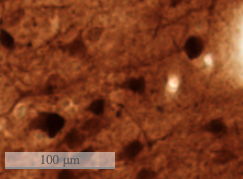
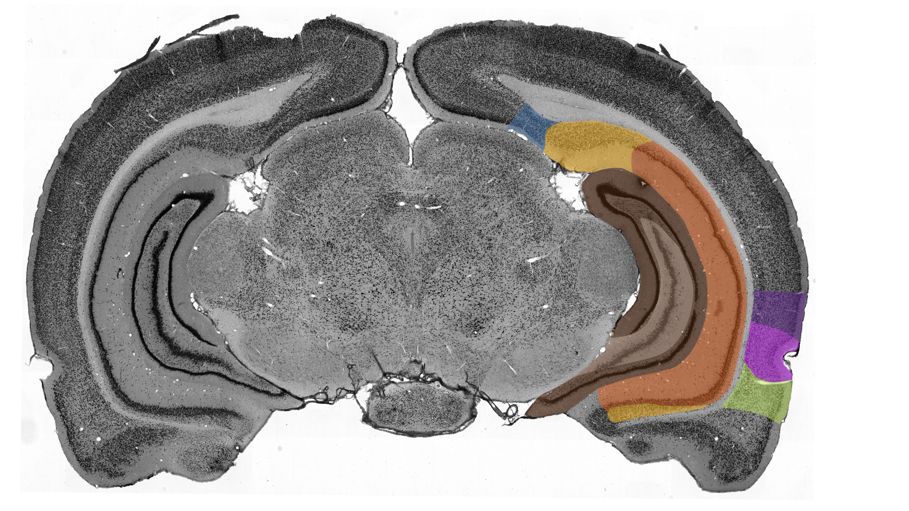
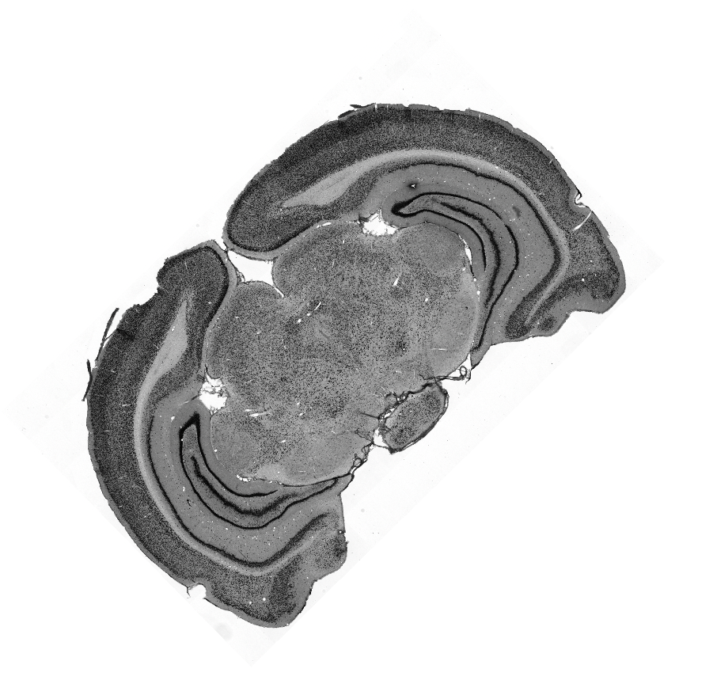
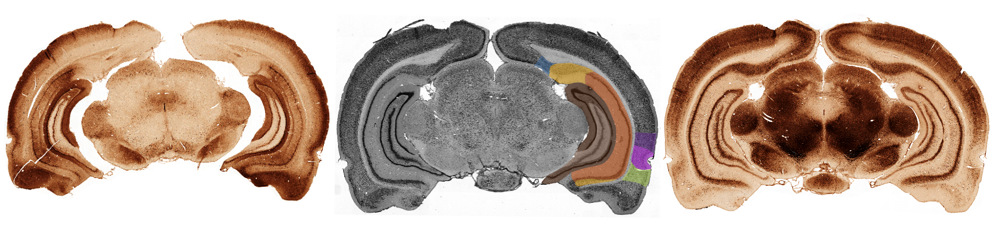
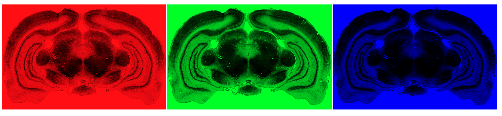
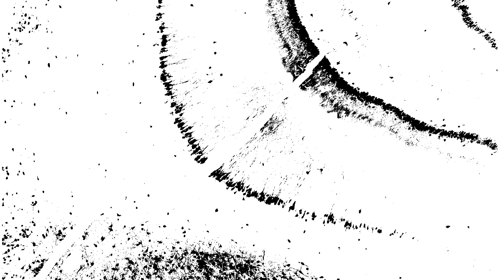

# OpenSeadragon histology imaging demos
## Scale bar
Classical scale bar. Requires resolution metadata.

https://darwinjob.github.io/osd-demo/scalebar.html

## Image annotations
SVG drawing on top of an image. 

https://darwinjob.github.io/osd-demo/svg.html

## Image rotation
Use two fingers pinch on touch screen devices. Or the slider on the top.

https://darwinjob.github.io/osd-demo/rotation.html

## Synchronized triple image viewer
3 synchronized image viewers. The number of viewers is virtually unlimited. 

https://darwinjob.github.io/osd-demo/triple.html

## RGB channels separation
Based on the filters plugin.

https://darwinjob.github.io/osd-demo/RGB_channels.html

## Overlayed images
2 or more images combined and overlayed. **Under development**. 

https://darwinjob.github.io/osd-demo/multi-image-overlay.html
## PNG overlay
PNG on top of an image. **Under development**. 

https://darwinjob.github.io/osd-demo/PNG-overlay.html
## NIST filters demo applied to an histology image
Try Brightness, Contrast, Exposure, Gamma, Grayscale, Invert and **Thresholding** as the example.

https://darwinjob.github.io/OpenSeadragonFiltering/

