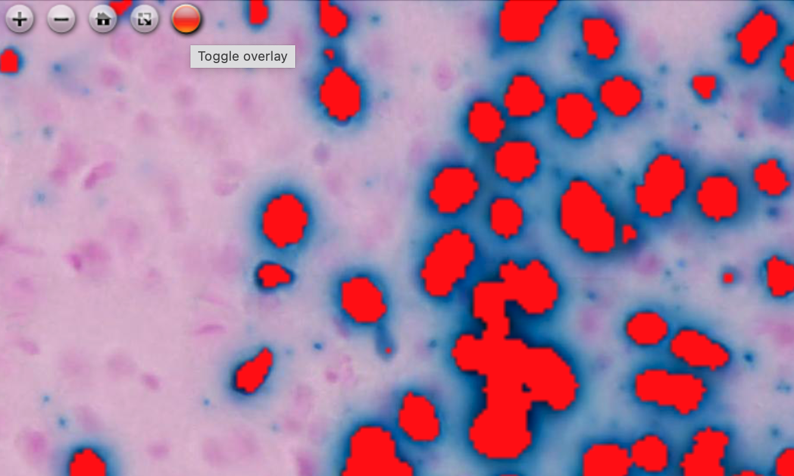
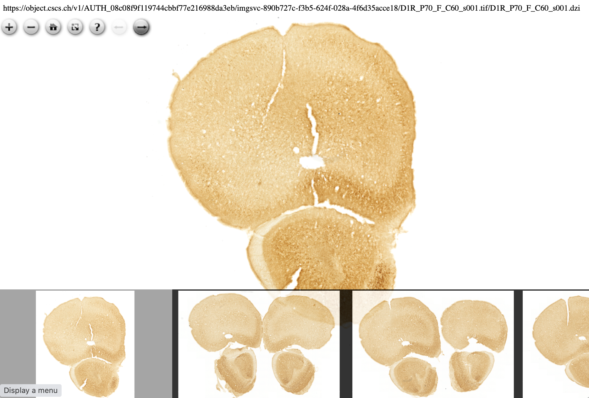
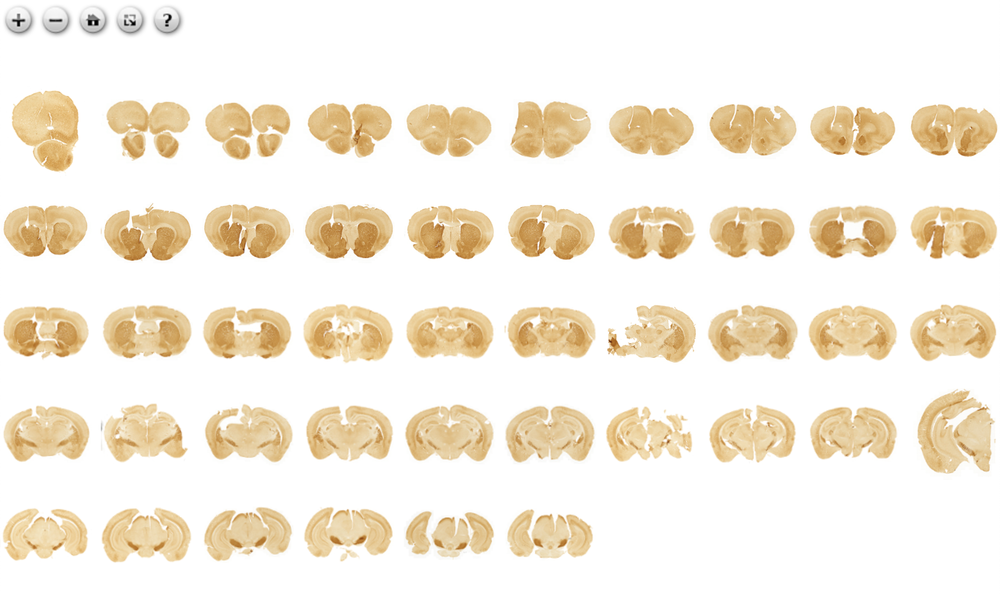

# OpenSeadragon histology imaging demos
## Scale bar
Classic scale bar. Requires resolution metadata.

https://darwinjob.github.io/osd-demo/scalebar.html

## Image annotations
SVG drawing on top of an image. 

https://darwinjob.github.io/osd-demo/svg.html

## Image rotation
Use two fingers pinch on touch screen devices. Or the slider on the top.

https://darwinjob.github.io/osd-demo/rotation.html

## Synchronized triple image viewer
3 synchronized image viewers. The number of viewers is virtually unlimited. Use cases: [Rat Hippocampus Atlas](https://www.frontiersin.org/articles/10.3389/fninf.2011.00002/full)

https://darwinjob.github.io/osd-demo/triple.html

## RGB channels separation
Based on the filters plugin.

https://darwinjob.github.io/osd-demo/RGB_channels.html

## Overlayed images
2 or more images combined and overlayed. **Under development**. 

https://darwinjob.github.io/osd-demo/multi-image-overlay.html
## PNG overlay
PNG on top of an image. Zoom in and push the toggle button. Use cases: [LZ](https://github.com/Tevemadar/LocaliZoom) like visualization; displaying ilastik output  

https://darwinjob.github.io/osd-demo/PNG_overlay.html

## NIST filters demo applied to an histology image
Try Brightness, Contrast, Exposure, Gamma, Grayscale, Invert and **Thresholding** as the example.

https://darwinjob.github.io/OpenSeadragonFiltering/

## Multi-Image viewer
The viewer is deployed and already in use. Two modes are available.
### Filmstrip mode
Classic filmstrip viewer. Use the arrow buttons from the toolbar on the top or the mouse wheel to browse images.

https://miosdv.apps-dev.hbp.eu/index.html?bucket=https://data-proxy.ebrains.eu/api/v1/public/buckets/img-346808ac-46fb-11ec-98bf-50eb718d929d

###Collection mode
All images displayed as single one. Zoom and pan as usual.

